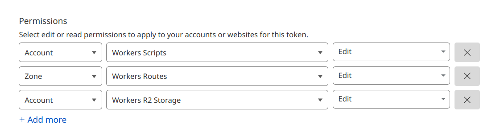

# Colors

这是一个用于获取中国传统色和日本传统色的 API。这个项目基于 Cloudflare Worker 创建。每隔一定时间会自动获取中国传统色和日本传统色并存储在 Cloudflare R2 中。

## 开发

安装依赖:

```bash
pnpm i
```

启动:

```bash
pnpm run dev
```

打开浏览器访问 <http://localhost:8787>。

要测试 scheduled，可执行:

```bash
curl "http://localhost:8787/__scheduled"
```

## 部署到 Cloudflare

### 要求

首先在 Cloudflare 创建 R2，`name` 填写 `colors`（如果填其他的，需要确保 `./wrangler.toml` 文件中的 `bucket_name` 值与其一致）。

### 部署

有两种方式可以部署。

#### 直接部署

第一种方式是用命令直接部署：

```bash
pnpm run deploy
```

在终端执行上述命令后应该会自动在浏览器打开一个授权界面。在界面中允许就行了。

#### 使用 Github Action 自动部署

第二种方式是通过 GitHub Actions 自动部署到 Cloudflare 上。

首先在 Github 上创建仓库。

然后，前往 Cloudflare [创建 API](https://dash.cloudflare.com/profile/api-tokens)，确保 API 具有如下图所示的基本权限：



将返回的 token 添加到刚刚创建的 Github 仓库的 secrets 中，名称为 `CLOUDFLARE_API_TOKEN`；并创建一个名为 `CLOUDFLARE_ACCOUNT_ID` 的 secrets，值填写你的 Cloudflare Account ID。

然后将此仓库的内容上传到你新建的仓库:

```bash
git clone https://github.com/nafnix/colors-api.git
git remote rm origin
git remote add origin <你的Github仓库地址>
git branch -M master
git push -u origin master
```
